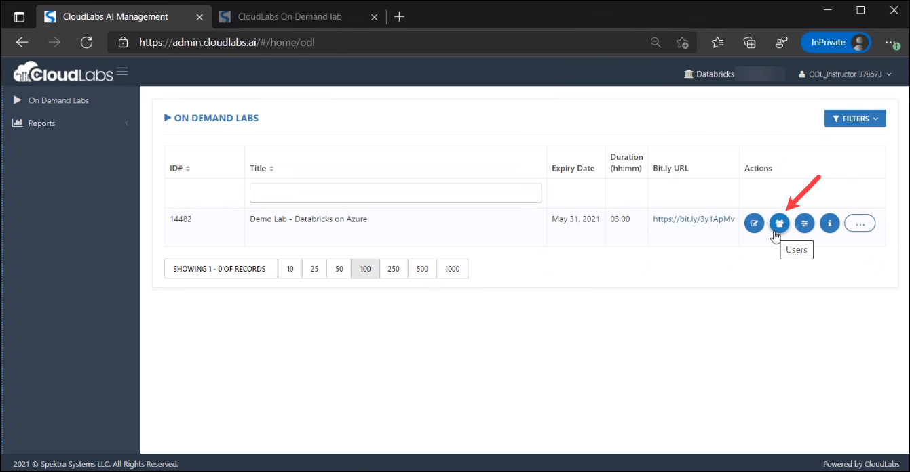
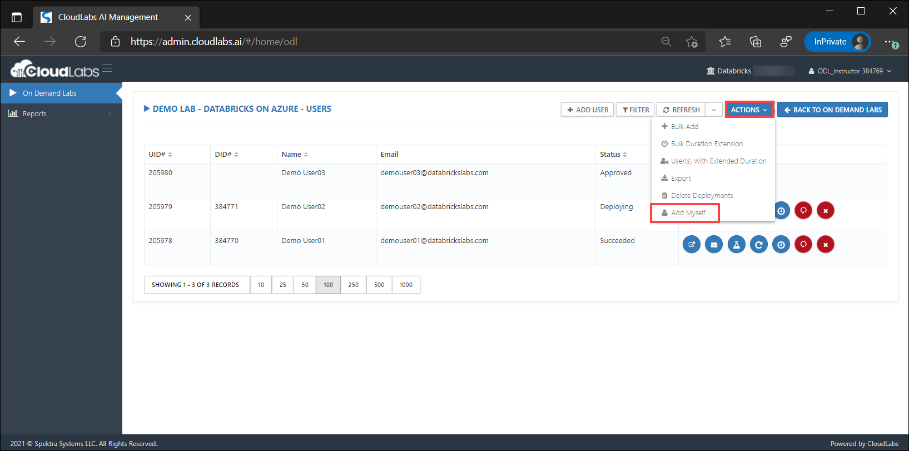
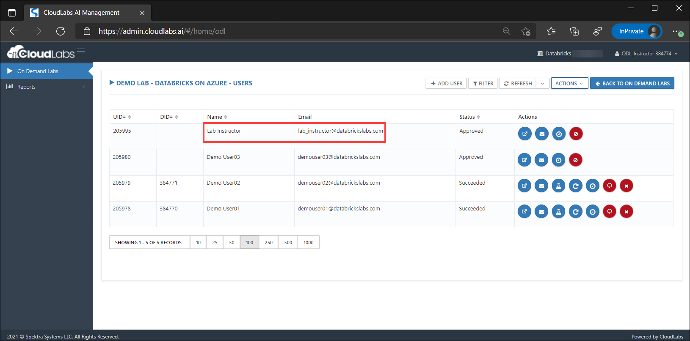
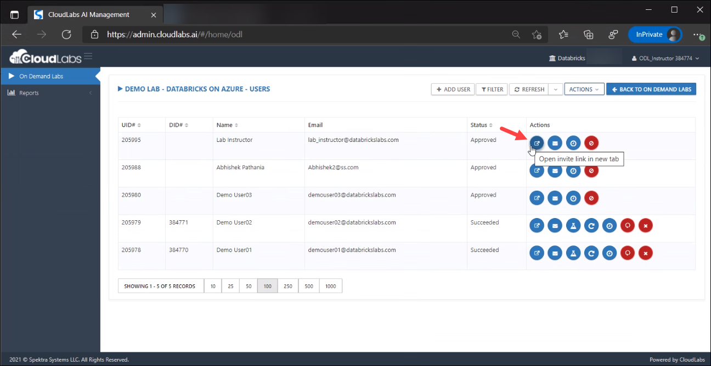
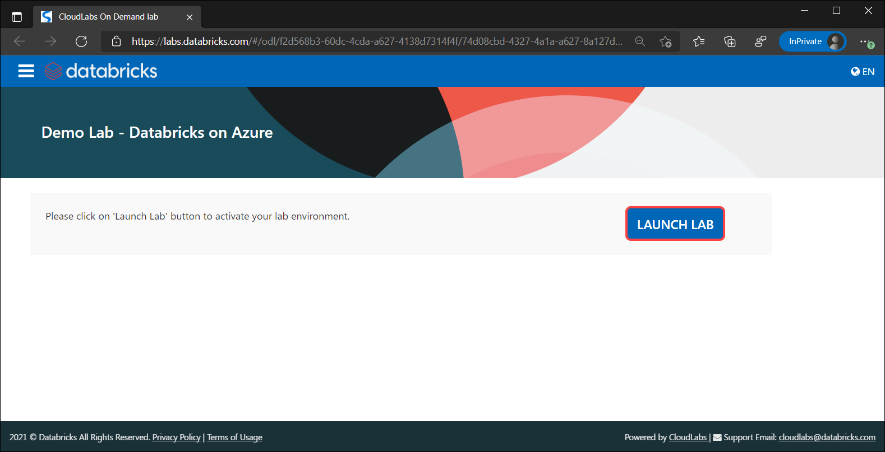

# Add Myself - Dedicated Workspace for Instructors

This feature allow instructors to add themselves to get their own workspace. 

1. First navigate to Users page by clicking on **Users** button.

    
   
2. To add yourself as instructor, click on **Actions** button and select **Add Myself**.

    

3. As soon as you select **Add Myself** option, an instructor account will automatically get created with your Name and Email address.

    

4. Your instructor account is ready. Now to access the workpspace you need to launch it.

5. Click on **Open invite link in new tab** and it will take you to a new tab.

   
   
6. Click on **Launch Lab** button. This will provide you the workspace details.

    

 &#x2B50; <b> Good to know:</b> You can login to this workspace with your Instructor account itself (odl_instructor_xxxxx@databricks.labs.onmicrosoft.com) 
 
