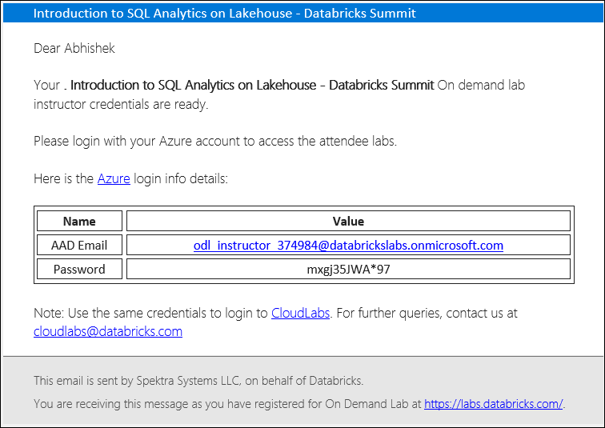
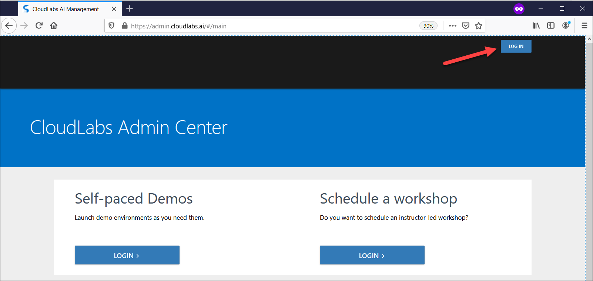
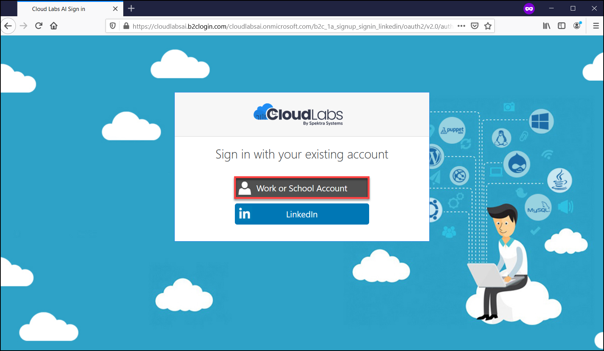
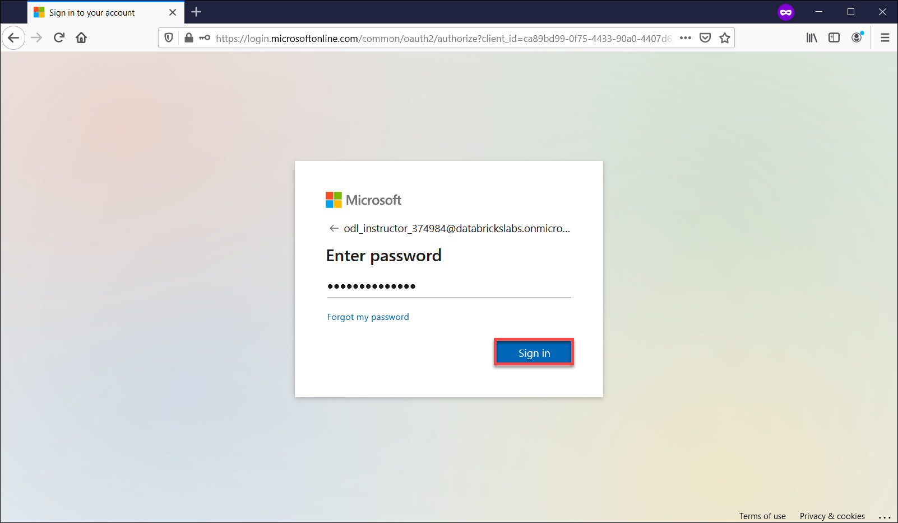

[Home](./../README.md)

# Instructor Login to CloudLabs AI Portal 

The various features along with the self-service capabilities within CloudLabs enable instructors to efficiently manage the "Databricks hands-on labs".

Following are the steps to access the Cloudlabs AI Portal:

1. You will receive an email from CloudLabs <noreply@cloudlabs.ai> containing Instructor Credentials. Using those credentials, you will be able to access CloudLabs as well as Databricks workspaces.

>**Note**: Please check the **SPAM/JUNK** folder in case you cannot find the email from <noreply@cloudlabs.ai>

   

2. Navigate to <https://admin.cloudlabs.ai/> in an **incognito window**. 

3. Click on the **LOGIN** button, given in the top right corner.

   

4. Choose **Work or School Account** as the account type.
    
    
    
5. Enter the credentials provided to you via email and proceed with **Sign in** button.

    
  
> **Notes:** 
> - In case you get prompt saying **Permission requested**, then select **Accept**.
> - If you are asked to provide a Display name, leave it on default and click on **Continue**.
>  
 

&nbsp;&nbsp;&nbsp;&nbsp;&nbsp;&nbsp;&nbsp;&nbsp;&nbsp;&nbsp;&nbsp;&nbsp;&nbsp;&nbsp;&nbsp;&nbsp;&nbsp;&nbsp;&nbsp;&nbsp;&nbsp;&nbsp;&nbsp;&nbsp;&nbsp;&nbsp;&nbsp;&nbsp;&nbsp;&nbsp;&nbsp;&nbsp;&nbsp;&nbsp;&nbsp;&nbsp;&nbsp;&nbsp;&nbsp;&nbsp;&nbsp;&nbsp;&nbsp;&nbsp;&nbsp;&nbsp;&nbsp;&nbsp;&nbsp;&nbsp;&nbsp;&nbsp;&nbsp;&nbsp;&nbsp;&nbsp;&nbsp;&nbsp;&nbsp;&nbsp;&nbsp;&nbsp;&nbsp;&nbsp;&nbsp;&nbsp;&nbsp;&nbsp;&nbsp;&nbsp;&nbsp;&nbsp;&nbsp;&nbsp;&nbsp;&nbsp;&nbsp;&nbsp;&nbsp;&nbsp;&nbsp;&nbsp;&nbsp;&nbsp;&nbsp;&nbsp;&nbsp;&nbsp;&nbsp;&nbsp;&nbsp;&nbsp;&nbsp;&nbsp;&nbsp;&nbsp;&nbsp;&nbsp;&nbsp;&nbsp;&nbsp;&nbsp;&nbsp;&nbsp;&nbsp;&nbsp;&nbsp;&nbsp;&nbsp;&nbsp;&nbsp;&nbsp;&nbsp;&nbsp;&nbsp;&nbsp;&nbsp;&nbsp;&nbsp;&nbsp;&nbsp;&nbsp;&nbsp;&nbsp;&nbsp;&nbsp;&nbsp;&nbsp;&nbsp;&nbsp;&nbsp;&nbsp;&nbsp;&nbsp;&nbsp;[Next](./Manage-On-Demand-Labs-readme.md)
