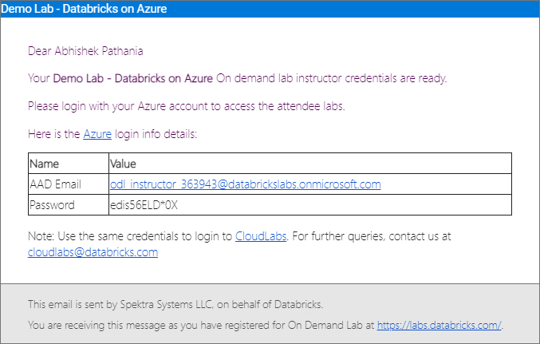
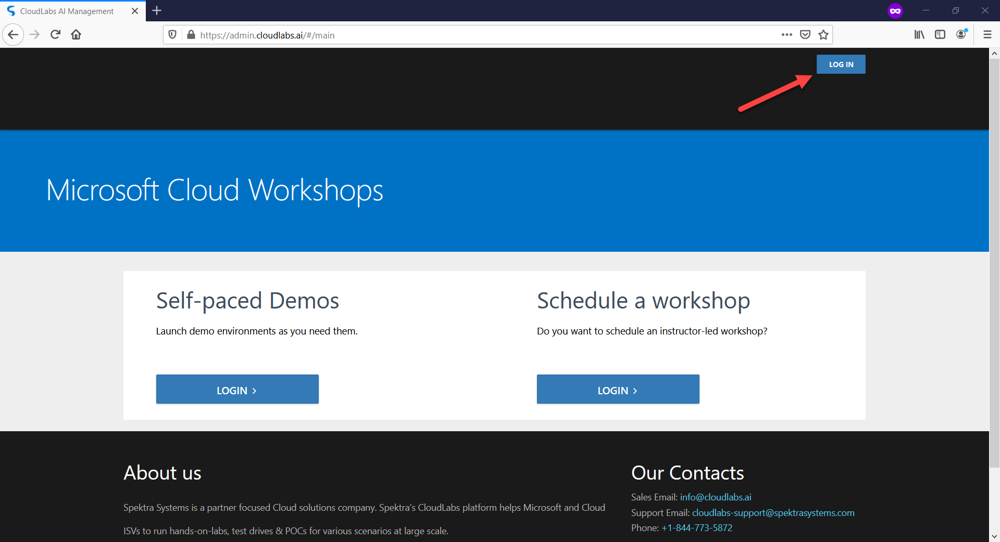
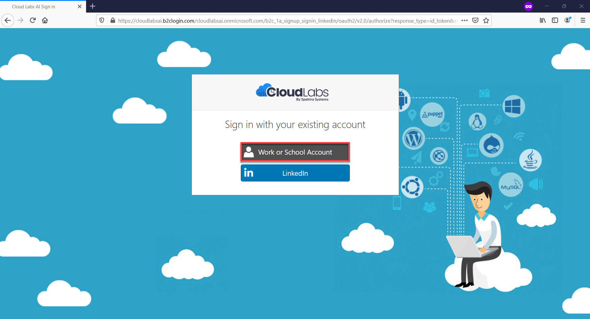
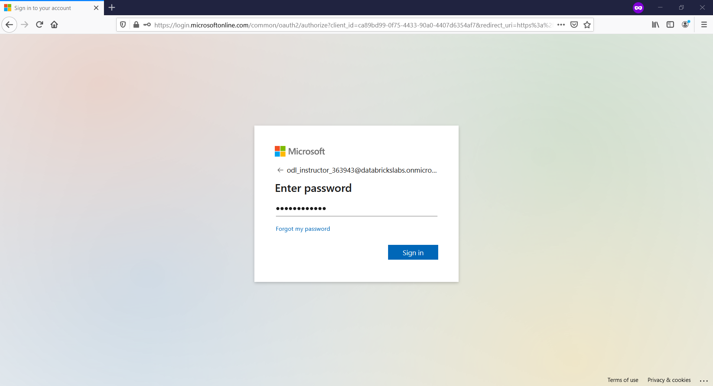

# Instructor Login to CloudLabs AI Portal 

The self-services and features available in CloudLabs enable instructors to fully manage the hands-on Databricks labs. 

Following are the steps to access the Cloudlabs AI Portal:

1. You will receive an email from CloudLabs <<noreply@cloudlabs.ai>> containing Instructor Credentials(i.e., username and password). Using those credentials, you will be able to access CloudLabs AI Portal as well as Databricks workspaces.

   <kbd>  </kbd>

2. In your browser, navigate to https://admin.cloudlabs.ai/

3. Click on the **LOG IN** button, given in the top right corner.

    <kbd>  </kbd>

4. Choose **Work or School Account** as account type.
    
    <kbd>  </kbd>
    
5. Enter the credentials provided to you via email and process with **Sign in**

    <kbd>  </kbd>

> **Note:** In case you get prompt saying **Permission requested**, then select **Accept**.

> **Note:** If you are asked to provide a Display name, leave it on default and click on **Continue**.
 
5. Once you logged in successfully, you should be able to see the **On Demand Labs** page

     <kdb>  </kbd>
