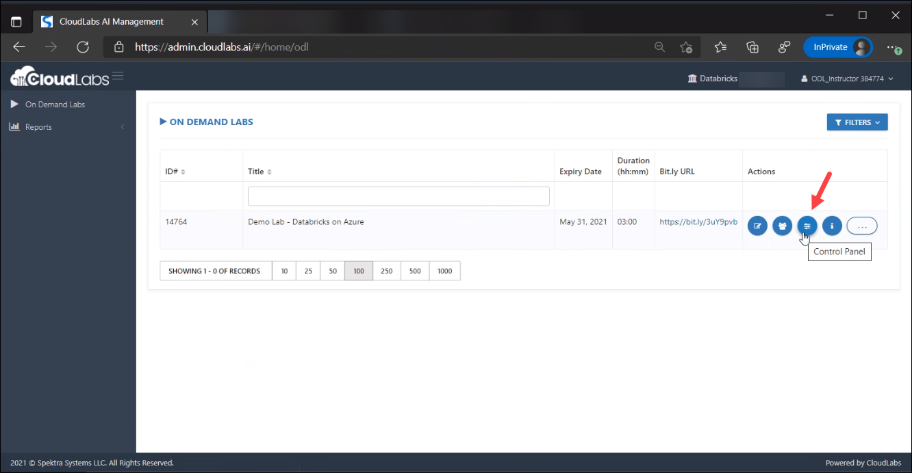
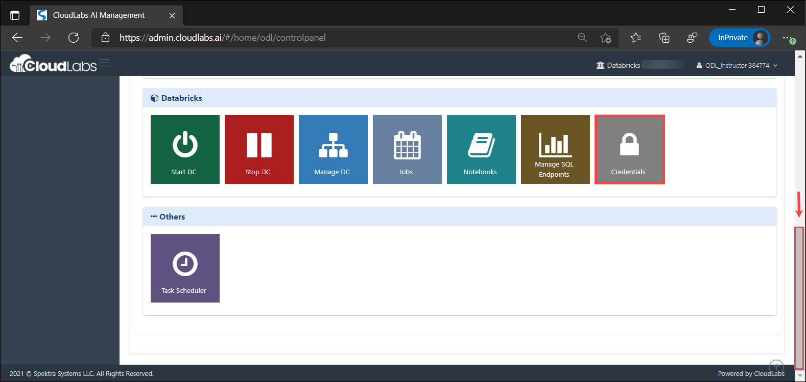
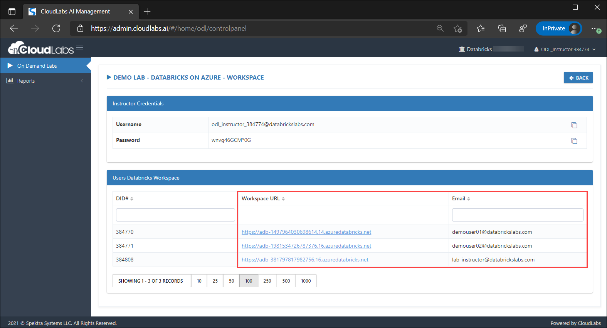

[Home](./../README.md)

# Manage Users' workspace

As an Instructor, you can help users during the lab incase if they need any assistance. 

1. Click on the **Control Panel** button.

    

2. Scroll down to the **Databricks** section and click on **Credentials** tab.

    

3. In the credentials tab, you will have **Workspace URL** of all the registered users against their respective Email.

    

4. The **Workspace URL** is a functionality that provides you the access to users' workspace by just clicking on the URL. Instructor can simply click on the workpsace link in CloudLabs and automatically login to the student workspace.

