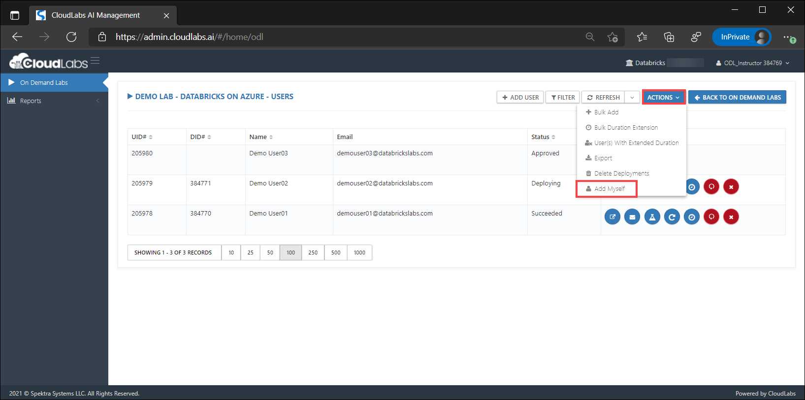

[Home](./../README.md)

# Manage Task Scheduler

This feature allows instructors to manage the lab schedules like Terminate and Resume clusters OR EndPoints.

1. Click on the **Control Panel** button.

    
   
2. Scroll down to the bottom of the page i.e. **Others** section and click on **Task Scheduler** tab.

    

3. As soon as you select **Add Myself** option, your account (name and email address) will appear in the list.

    

4. Now you can start your lab environment and get the workspace details by clicking on **Open invite link in new tab** 

   
   
5. Click on the **LAUNCH LAB** button.

   
   
6. Once your workspace is ready, you will have the workspace URL to access it. 
   
   >**Note:** You can use your Instructor credentials to login to this workspace.
 
   
   
   [Back](./View-and-Manage-Users-readme.md)&nbsp;&nbsp;&nbsp;&nbsp;&nbsp;&nbsp;&nbsp;&nbsp;&nbsp;&nbsp;&nbsp;&nbsp;&nbsp;&nbsp;&nbsp;&nbsp;&nbsp;&nbsp;&nbsp;&nbsp;&nbsp;&nbsp;&nbsp;&nbsp;&nbsp;&nbsp;&nbsp;&nbsp;&nbsp;&nbsp;&nbsp;&nbsp;&nbsp;&nbsp;&nbsp;&nbsp;&nbsp;&nbsp;&nbsp;&nbsp;&nbsp;&nbsp;&nbsp;&nbsp;&nbsp;&nbsp;&nbsp;&nbsp;&nbsp;&nbsp;&nbsp;&nbsp;&nbsp;&nbsp;&nbsp;&nbsp;&nbsp;&nbsp;&nbsp;&nbsp;&nbsp;&nbsp;&nbsp;&nbsp;&nbsp;&nbsp;&nbsp;&nbsp;&nbsp;&nbsp;&nbsp;&nbsp;&nbsp;&nbsp;&nbsp;&nbsp;&nbsp;&nbsp;&nbsp;&nbsp;&nbsp;&nbsp;&nbsp;&nbsp;&nbsp;&nbsp;&nbsp;&nbsp;&nbsp;&nbsp;&nbsp;&nbsp;&nbsp;&nbsp;&nbsp;&nbsp;&nbsp;&nbsp;&nbsp;&nbsp;&nbsp;&nbsp;&nbsp;&nbsp;&nbsp;&nbsp;&nbsp;&nbsp;&nbsp;&nbsp;&nbsp;&nbsp;&nbsp;&nbsp;&nbsp;&nbsp;&nbsp;&nbsp;&nbsp;&nbsp;&nbsp;&nbsp;&nbsp;&nbsp;&nbsp;&nbsp;&nbsp;&nbsp;&nbsp;&nbsp;&nbsp;&nbsp;&nbsp;&nbsp;&nbsp;[Next](./Manage-Users'-workspace-readme.md) 
                                                                                                                                          
                                                                                                                                          
                                                                                                                                          
