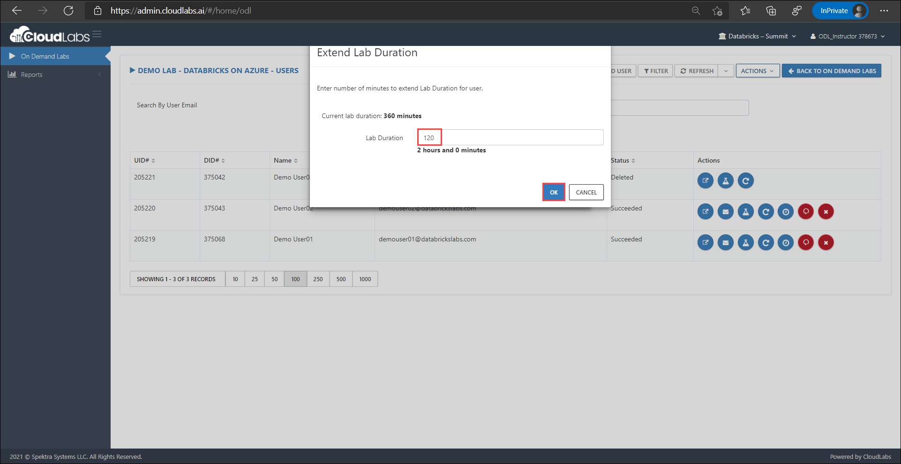
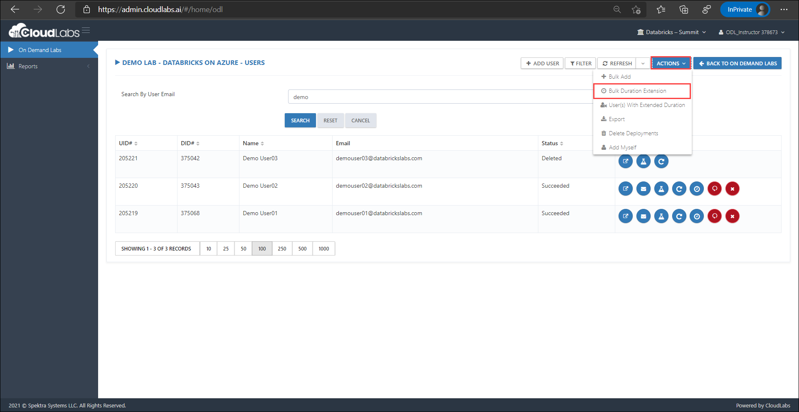
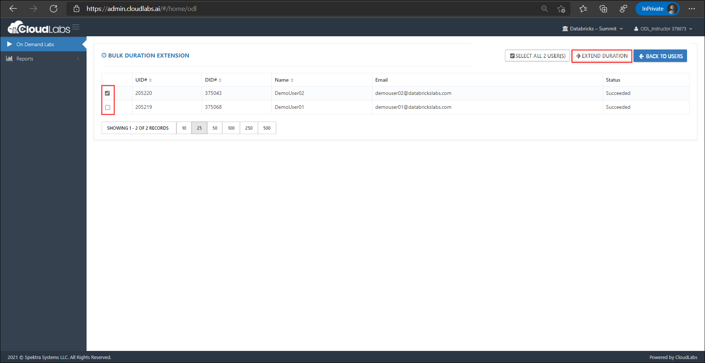

# View and Manage Users

The **Users** section features the following:

* Number of registered users
* Registered users' details such as First Name, Last Name and Email Address
* Deployment status of users' environment

IMAGE of user (with numbering)

### **Add-ons**

**Extend duration** - After the specified duration, environment is self-destructed. In case if you have a user who needs the environment available for a few hours or so, you can extend the duration. However, extending should happen before the initial duration expire, as we can’t recover a deleted environment.

1. Extend duration for an Individual user

* On the User's page in the right side, click on **Extend Duration** button. 
* Enter the duration in **Lab Duration** block.
* Click on **OK** to save the changes.

   <kbd>  </kbd>

2. Extend duration for Multiple users

* On the User's page in the right top corner, click on **Actions** button.
* Select **Bulk Duration Extension** from the drop down.

   <kbd>  </kbd>
   
* On Bulk Duration Extension page, you will see list of registered users.
* You can either select multiple users or all the users as per your requirement
* For **All Users:**
  - Click on **Select All User(s)** button to select all the users and add the desired duration.
  - Click on **Extend Duration** button.
   
   <kbd>  </kbd>
   
* For **Multiple Users:** 
  - Check the boxes to select particular the users and add the desired duration,
  - Click on **Extend Duration** button.
  
  <kbd>  </kbd>
  

