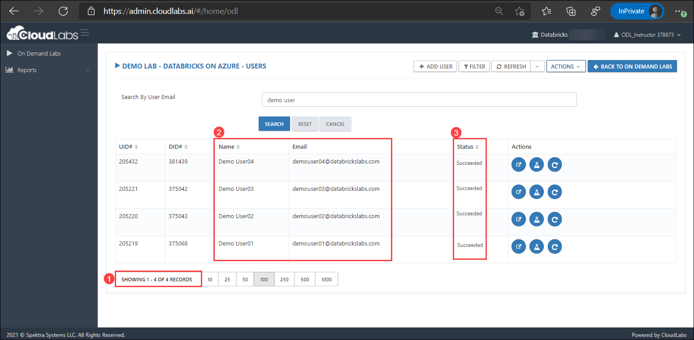
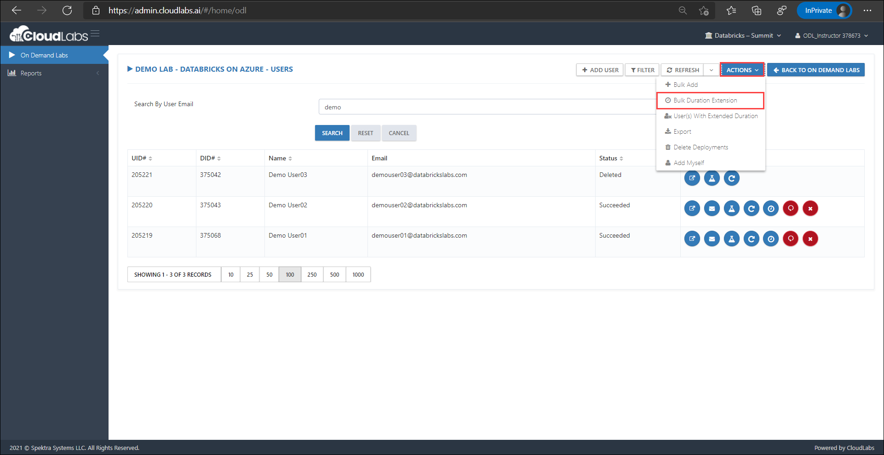
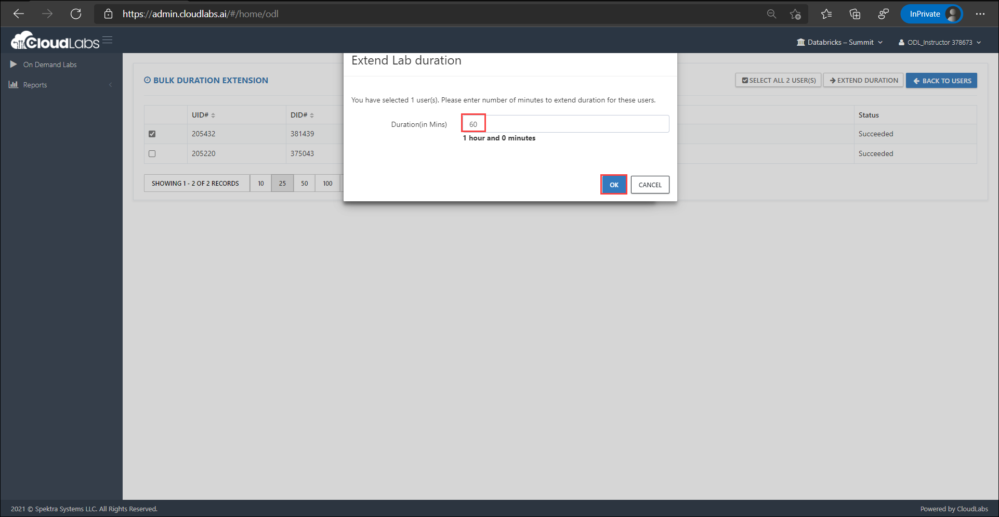

[Home](./../README.md)

# View and Manage Users

In the **Users** page you will find all the relevant information about registered users and their environments.

To navigate to the Users page, click on **Users** button as shown below:

    

The **Users** section features the following:

   **1.** Number of registered users
   
   **2.** Registered users' details such as Name and Email Address
   
   **3.** Deployment status of users' environment
   
    

### **Add-ons**

**Extend duration** - In order to control lab costs, every environment is auto-deleted after a specified duration. However, the duration of the environment can easily be extended if a user requires additional time. You can do so by following the below steps and before the initial duration expires. Lab environment once deleted can not be recovered.

1. Extend duration for an **Individual user**

   * On the User's page in the right side, click on **Extend Duration (1)** button. 
   * Enter the duration in **Lab Duration (2)** block.
   * Click on **OK (3)** to save the changes.

       

2. Extend duration for **Multiple users**

   * On the User's page in the right top corner, click on the **Actions** button.
   * Select **Bulk Duration Extension** from the drop down.

      
   
   * On Bulk Duration Extension page, you will see list of registered users.
   * You can either select multiple users or all the users as per your requirement
   * For **All Users:**
     - Click on **Select All User(s)** button to select all the users and then click on the **Extend Duration** button.
   
       

   - Add the desired duration and click on **OK**
   
       
   
   * For **Multiple Users:** 
    - Check the boxes to select particular the users and then click on the **Extend Duration** button.
  
      
   
   - Add the desired duration and click on **OK**

       

[Back](./Manage-On-Demand-Labs-readme.md)&nbsp;&nbsp;&nbsp;&nbsp;&nbsp;&nbsp;&nbsp;&nbsp;&nbsp;&nbsp;&nbsp;&nbsp;&nbsp;&nbsp;&nbsp;&nbsp;&nbsp;&nbsp;&nbsp;&nbsp;&nbsp;&nbsp;&nbsp;&nbsp;&nbsp;&nbsp;&nbsp;&nbsp;&nbsp;&nbsp;&nbsp;&nbsp;&nbsp;&nbsp;&nbsp;&nbsp;&nbsp;&nbsp;&nbsp;&nbsp;&nbsp;&nbsp;&nbsp;&nbsp;&nbsp;&nbsp;&nbsp;&nbsp;&nbsp;&nbsp;&nbsp;&nbsp;&nbsp;&nbsp;&nbsp;&nbsp;&nbsp;&nbsp;&nbsp;&nbsp;&nbsp;&nbsp;&nbsp;&nbsp;&nbsp;&nbsp;&nbsp;&nbsp;&nbsp;&nbsp;&nbsp;&nbsp;&nbsp;&nbsp;&nbsp;&nbsp;&nbsp;&nbsp;&nbsp;&nbsp;&nbsp;&nbsp;&nbsp;&nbsp;&nbsp;&nbsp;&nbsp;&nbsp;&nbsp;&nbsp;&nbsp;&nbsp;&nbsp;&nbsp;&nbsp;&nbsp;&nbsp;&nbsp;&nbsp;&nbsp;&nbsp;&nbsp;&nbsp;&nbsp;&nbsp;&nbsp;&nbsp;&nbsp;&nbsp;&nbsp;&nbsp;&nbsp;&nbsp;&nbsp;&nbsp;&nbsp;&nbsp;&nbsp;&nbsp;&nbsp;&nbsp;&nbsp;&nbsp;&nbsp;&nbsp;&nbsp;&nbsp;&nbsp;&nbsp;&nbsp;&nbsp;&nbsp;&nbsp;&nbsp;&nbsp;[Next](./Add-Myself-Dedicated-Workspace-for-Instructors-readme.md) 

